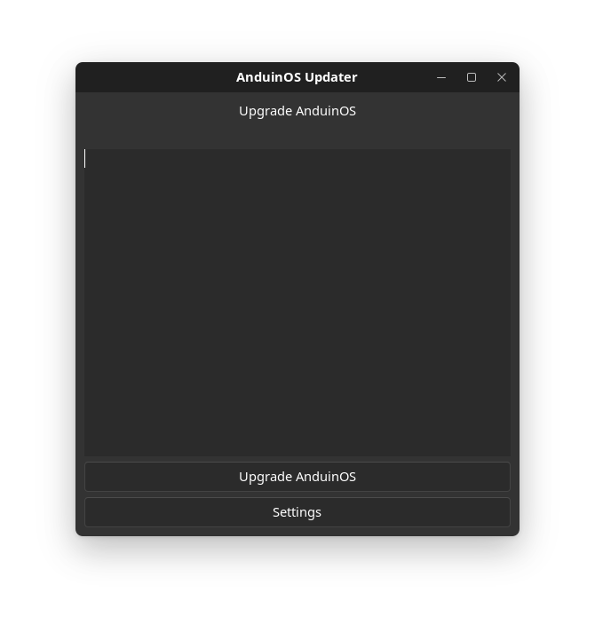

[](https://www.gnu.org/licenses/gpl-3.0)
[](https://www.gtk.org/)
[](https://www.python.org/)


# AnduinOS Updater

AnduinOS Updater is a GTK-based graphical tool for upgrading AnduinOS (Ubuntu-based) systems via do_anduinos_upgrade.



## Features
- One-click AnduinOS upgrade (do_anduinos_upgrade)
- Multilanguage support (English, Russian)
- Simple settings dialog (language selection)
- Modern GTK3 interface

## Requirements
- Python 3
- PyGObject (GTK3 bindings)
- pkexec, do_anduinos_upgrade (for full functionality)

## Installation
1. Install dependencies:
   ```sh
   sudo apt update
   sudo apt install python3-gi python3-gi-cairo gir1.2-gtk-3.0 pkexec
   ```
2. Download and extract the latest release from [GitHub Releases](https://github.com/Domanffe/AnduinUpdater/releases).
3. In the extracted folder, run:
   ```sh
   sudo ./install.sh
   ```
   This will install the launcher, .desktop file, and all required files to your system.

## Usage
- Launch "AnduinOS Updater" from your application menu
- Or run in terminal:
  ```sh
  anduinupdater
  ```

## Uninstallation
To remove AnduinOS Updater, delete these files:
```sh
sudo rm /usr/local/bin/anduinupdater
sudo rm /usr/local/share/applications/AnduinUpdater.desktop
sudo rm -r /usr/local/share/anduinupdater
sudo rm /usr/local/share/doc/anduinupdater/LICENSE
sudo rm /usr/local/share/doc/anduinupdater/README.md
```

## License
GPL-3.0